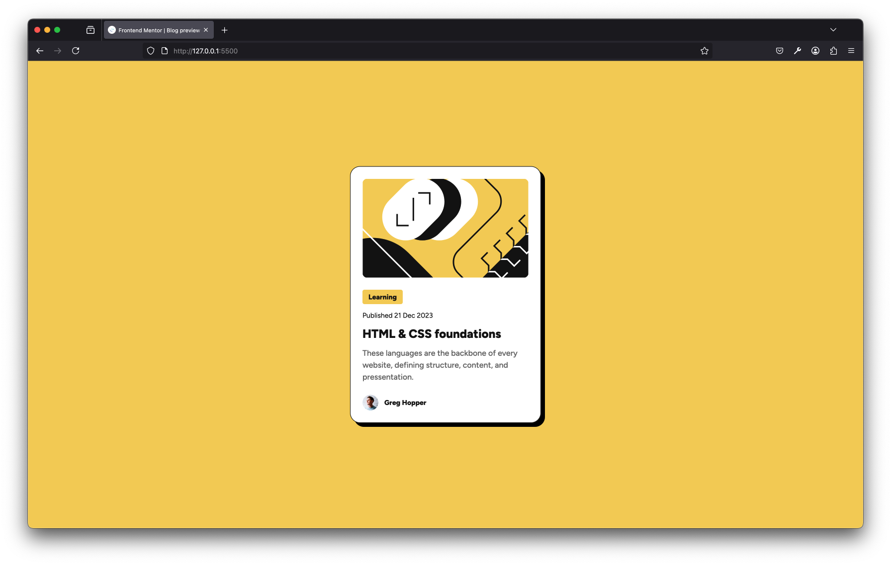

# Frontend Mentor - Blog preview card solution

This is a solution to the [Blog preview card challenge on Frontend Mentor](https://www.frontendmentor.io/challenges/blog-preview-card-ckPaj01IcS). Frontend Mentor challenges help you improve your coding skills by building realistic projects. 

## Table of contents

- [Overview](#overview)
  - [The challenge](#the-challenge)
  - [Screenshot](#screenshot)
  - [Links](#links)
- [My process](#my-process)
  - [Built with](#built-with)
  - [What I learned](#what-i-learned)
  - [Continued development](#continued-development)
  - [Useful resources](#useful-resources)
- [Author](#author)
- [Acknowledgments](#acknowledgments)

## Overview

### The challenge

Users should be able to:

- See hover and focus states for all interactive elements on the page

### Screenshot

### Links

- Solution URL: [Add solution URL here](https://your-solution-url.com)
- Live Site URL: [Add live site URL here](https://your-live-site-url.com)

## My process

### Built with

- Semantic HTML5 markup
- CSS custom properties
- Flexbox

### What I learned

I don't know if this is normal, but I tend to struggle with identifying elements that share common styles. I'm a bit obsessed about the DRY principle and want to write the most reusable CSS classes possible. During this project I've worked with a Figma file for the first time and I've created styles for the text and spacing according to the style guide. For example, I've set up `.text-preset-2` and `.text-preset-2-bold` classes. The common styles are in the first class and the second class only contains the styles to make the text bold. I find it awesome that Figma allows you to copy CSS custom properties and other code snippets directly into your CSS file.

### Pixel Perfect

I tried my best to make this site look as close to the original design as possible. I inspected the elements in Figma which was a lot of fun.

### Continued development

I want to continue with project-based learning and I hope that if I will use a CSS framework in the future, it will make the class-selection more straightforward.

## Author

- Frontend Mentor - [@larsb-dev](https://www.frontendmentor.io/profile/larsb-dev)